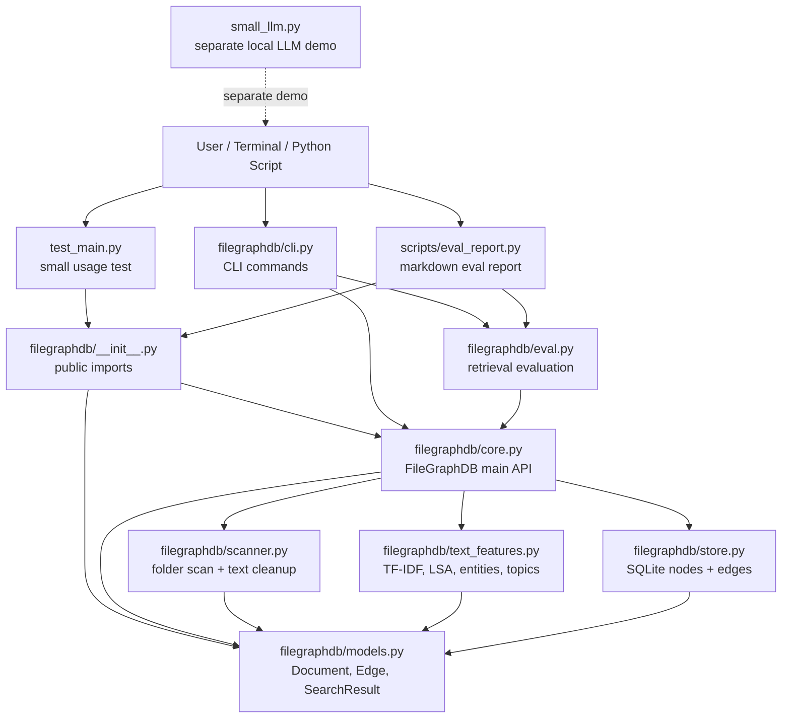
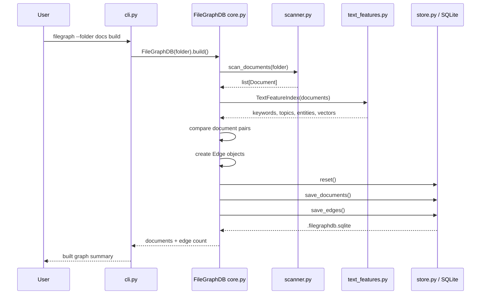
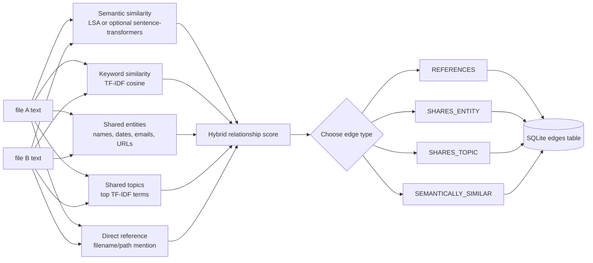
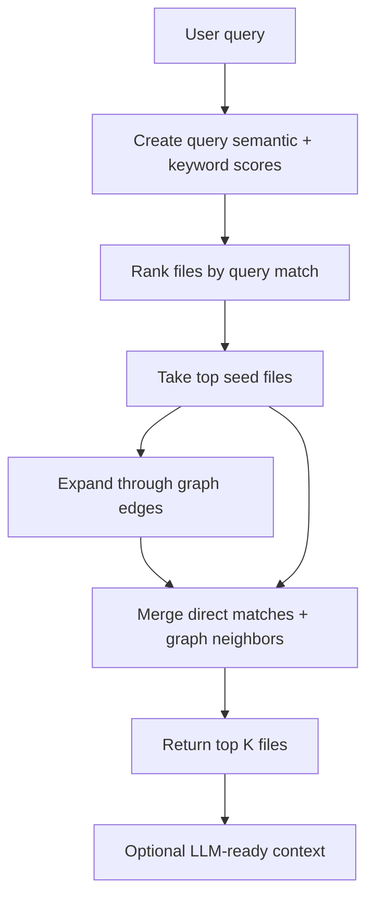
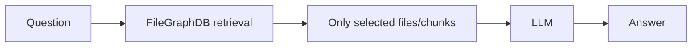
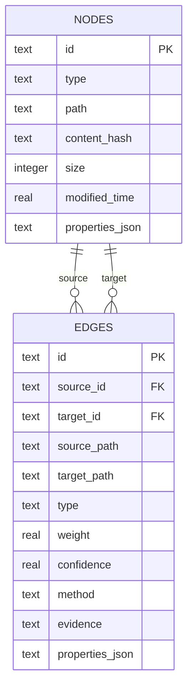
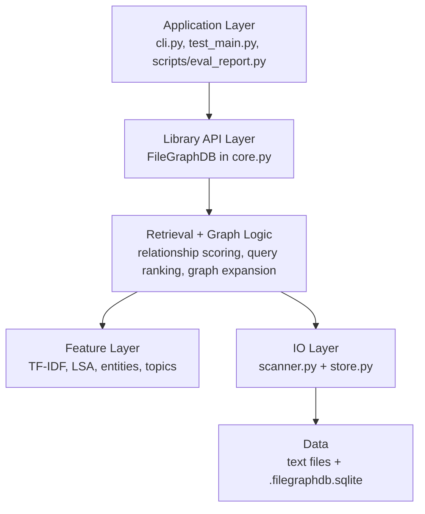

# FileGraphDB Codebase Graph

This file is a visual map of how the current codebase connects.

## 1. Module Dependency Graph



## 2. Build Graph Flow

This is what happens when you run:

```powershell
filegraph --folder ./docs build
```



## 3. Relationship Logic

Each file becomes a `Document` node. FileGraphDB compares each pair of files and creates an `Edge` when the relationship score is strong enough.



Current formula in `core.py`:

```text
score =
  0.46 * semantic_score
+ 0.24 * keyword_score
+ 0.14 * entity_overlap
+ 0.10 * topic_overlap
+ 0.06 * direct_reference_score
```

## 4. Query / Retrieval Flow

This is what happens when you run:

```powershell
filegraph --folder ./docs search "what caused the project delay"
```



The intended LLM usage is:



The LLM should not read all files. FileGraphDB selects the likely evidence first.

## 5. SQLite Storage Graph



## 6. Evaluation Flow

This is what happens when you run:

```powershell
filegraph --folder ./docs eval samples/eval/politics_guns_eval.jsonl --limit 10
```

```mermaid
flowchart TD
    EvalFile[JSONL eval cases]
    EvalPy[filegraphdb/eval.py]
    Core[filegraphdb/core.py retrieve]
    Results[Selected files]
    Metrics[Metrics]

    EvalFile --> EvalPy
    EvalPy --> Core
    Core --> Results
    Results --> Metrics

    Metrics --> Hit[hit@k]
    Metrics --> MRR[mean reciprocal rank]
    Metrics --> Recall[file recall]
    Metrics --> Terms[answer-term recall]
    Metrics --> Tokens[token savings]
```

## 7. Current Project Layers



## 8. What Each File Does

| File | Role |
|---|---|
| `filegraphdb/__init__.py` | Public library exports. Lets users write `from filegraphdb import FileGraphDB`. |
| `filegraphdb/core.py` | Main orchestration: build graph, create edges, retrieve files, estimate token savings. |
| `filegraphdb/scanner.py` | Reads folder files, supports extensionless files, cleans newsgroup headers. |
| `filegraphdb/text_features.py` | Extracts features and computes semantic/keyword similarity. |
| `filegraphdb/store.py` | Saves documents and relationships into SQLite. |
| `filegraphdb/models.py` | Defines `Document`, `Edge`, and `SearchResult`. |
| `filegraphdb/cli.py` | Terminal commands: `build`, `search`, `context`, `estimate`, `eval`, `edges`, `related`. |
| `filegraphdb/eval.py` | Evaluates retrieval accuracy using JSONL test cases. |
| `scripts/eval_report.py` | Creates a full Markdown report with queries, evidence, tokens, and costs. |
| `small_llm.py` | Separate small local LLM demo, not part of current graph retrieval pipeline. |
| `test_main.py` | Tiny Python usage example. |

