# `text_features.py` Visual Explanation

This diagram explains how `filegraphdb/text_features.py` turns text files into numbers and features that FileGraphDB can compare.

## 0. One Full Detailed Diagram

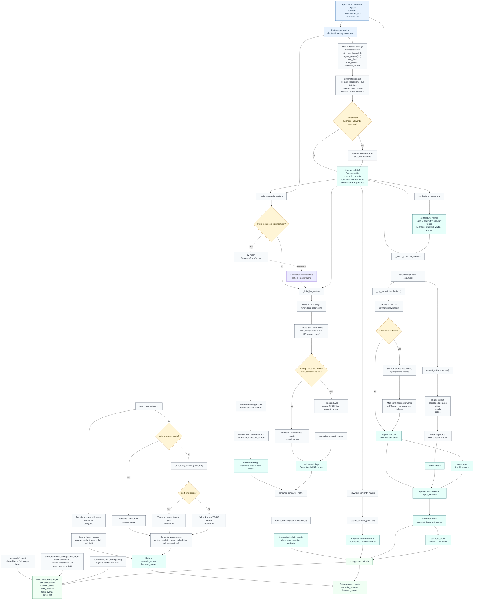

## 1. Big Picture

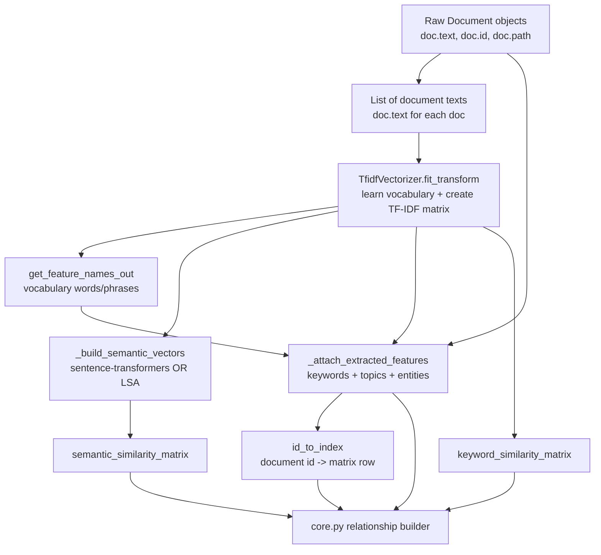

In simple words:

```text
documents
  -> important word matrix
  -> meaning vectors
  -> keywords/topics/entities
  -> similarity scores
  -> graph edges
```

## 2. Example Input

Imagine three files:

```text
doc1: "The Brady Bill requires a waiting period."
doc2: "Background checks are part of gun legislation."
doc3: "Tomatoes need soil and water."
```

They arrive as `Document` objects:

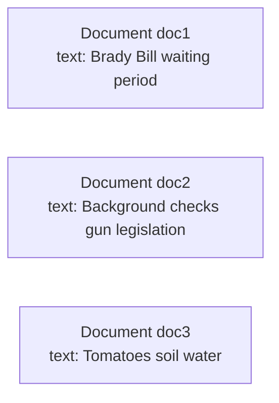

## 3. TF-IDF Matrix

This line:

```python
self.tfidf = self.vectorizer.fit_transform([doc.text for doc in documents])
```

does this:

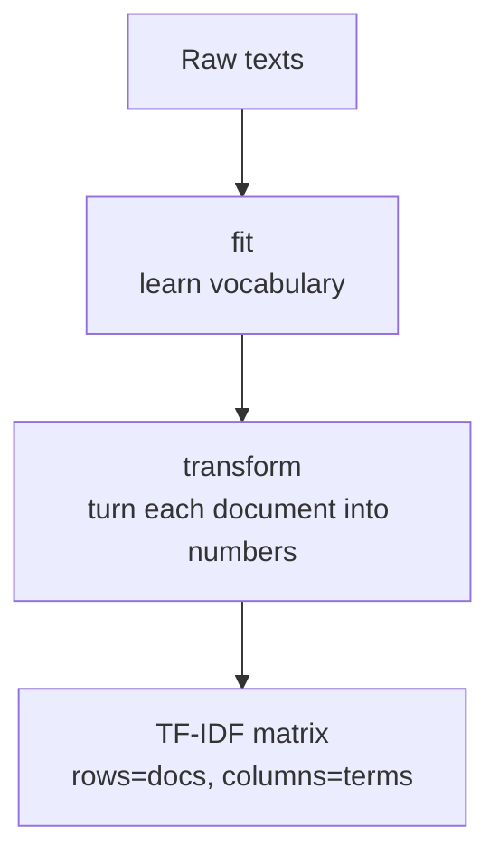

Example matrix:

```text
                  brady bill   waiting period   background check   gun legislation   tomatoes   soil
doc1                  high          high              0                 0              0        0
doc2                   0             0               high              high            0        0
doc3                   0             0                0                 0             high     high
```

Purpose:

```text
Find documents that share important words or phrases.
```

## 4. Feature Names

This line:

```python
self.feature_names = np.asarray(self.vectorizer.get_feature_names_out())
```

creates the column labels for the TF-IDF matrix.

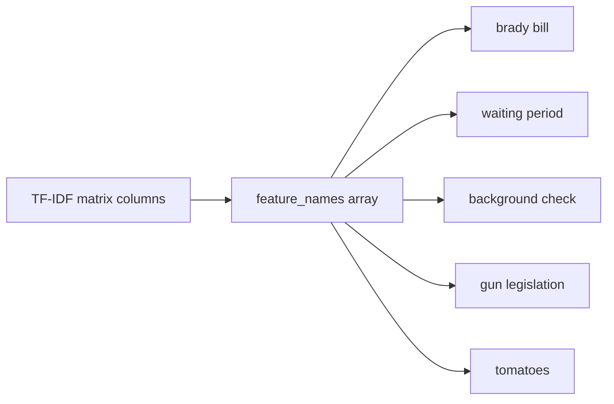

Purpose:

```text
When a document has high TF-IDF score in column 10,
feature_names tells us what word/phrase column 10 means.
```

## 5. Semantic Embeddings

This line:

```python
self.embeddings = self._build_semantic_vectors(prefer_sentence_transformers)
```

creates one meaning vector per document.

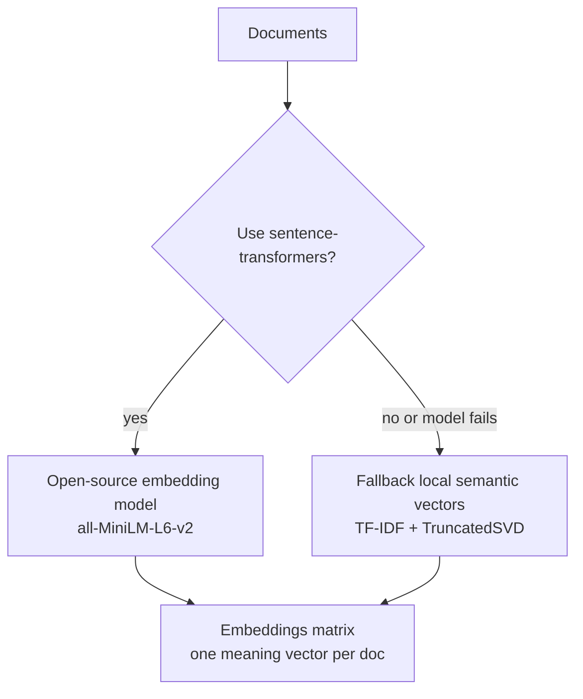

Example:

```text
doc1 embedding -> [politics, guns, law]
doc2 embedding -> [politics, guns, law]
doc3 embedding -> [gardening, plants, soil]
```

Purpose:

```text
Find documents with similar meaning, even if exact words are different.
```

## 6. Attach Extracted Features

This line:

```python
self.documents = self._attach_extracted_features()
```

adds sticky-note style features to each document.

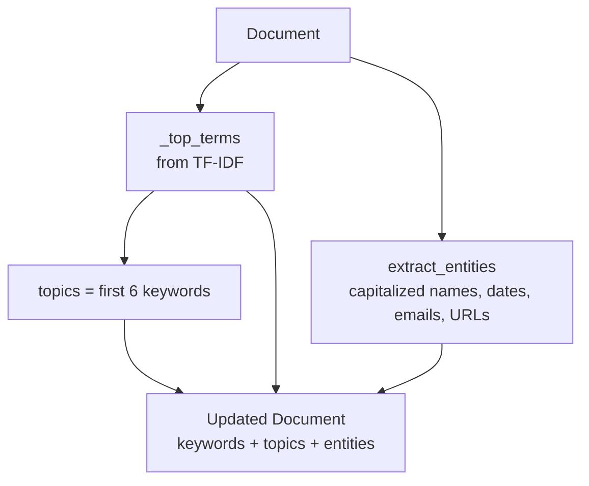

Example:

```text
Before:
Document(text="The Brady Bill requires a waiting period.", keywords=(), topics=(), entities=())

After:
Document(
  keywords=("brady bill", "waiting period"),
  topics=("brady bill", "waiting period"),
  entities=("Brady Bill",)
)
```

Purpose:

```text
core.py can later create graph edges from shared keywords, topics, and entities.
```

## 7. ID To Index Lookup

This line:

```python
self.id_to_index = {doc.id: index for index, doc in enumerate(self.documents)}
```

creates a map from document ID to row number.

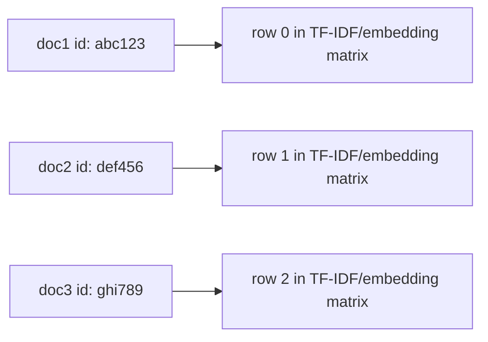

Purpose:

```text
Documents have IDs.
Matrices have row numbers.
This dictionary connects them.
```

## 8. Similarity Matrices

These methods:

```python
semantic_similarity_matrix()
keyword_similarity_matrix()
```

compare every document with every other document.

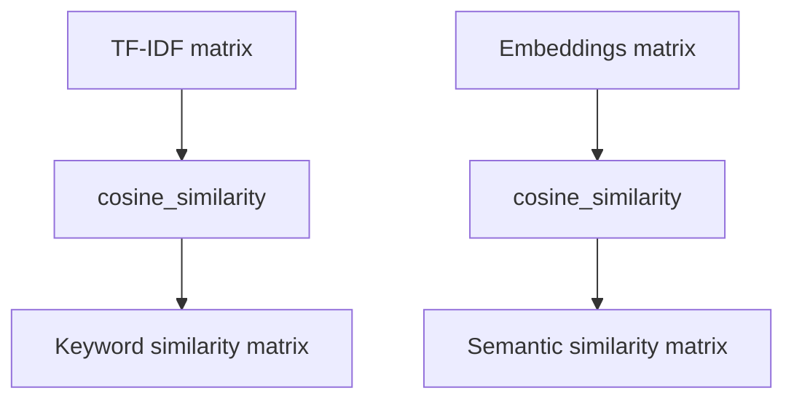

Example output:

```text
Keyword similarity:
        doc1   doc2   doc3
doc1    1.00   0.21   0.00
doc2    0.21   1.00   0.00
doc3    0.00   0.00   1.00

Semantic similarity:
        doc1   doc2   doc3
doc1    1.00   0.78   0.05
doc2    0.78   1.00   0.04
doc3    0.05   0.04   1.00
```

Purpose:

```text
core.py uses these scores to decide whether two files should be connected.
```

## 9. Query Scores

When user asks:

```text
"background check waiting period"
```

`query_scores()` does this:

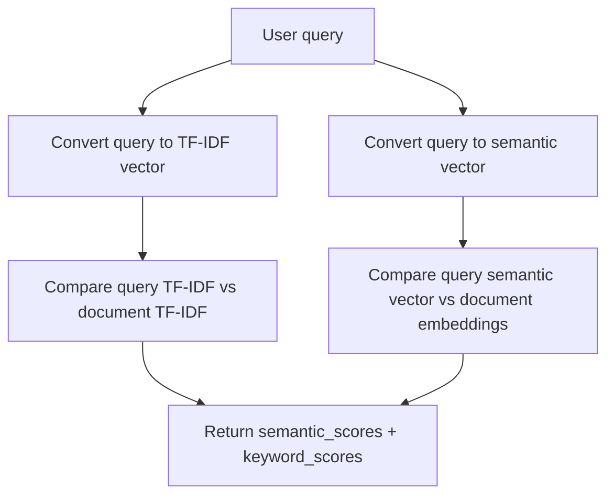

Purpose:

```text
Find which documents are most relevant to the user query.
```

## 10. Whole Data Flow In One View

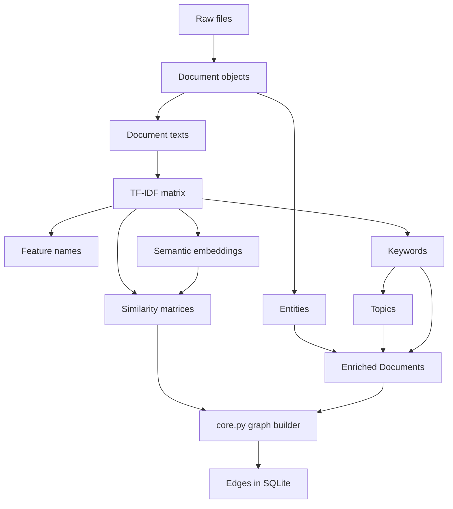
